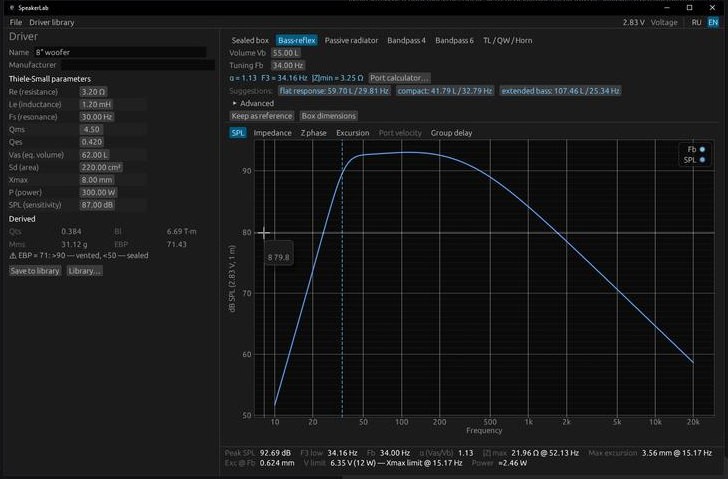
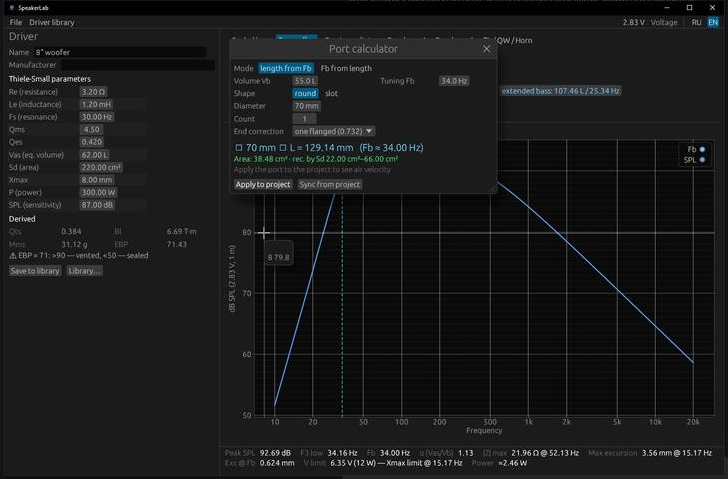
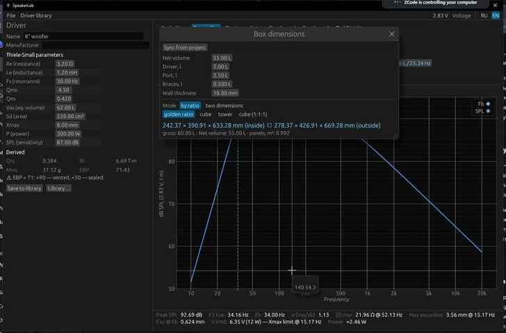
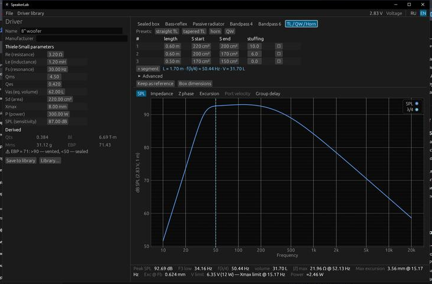
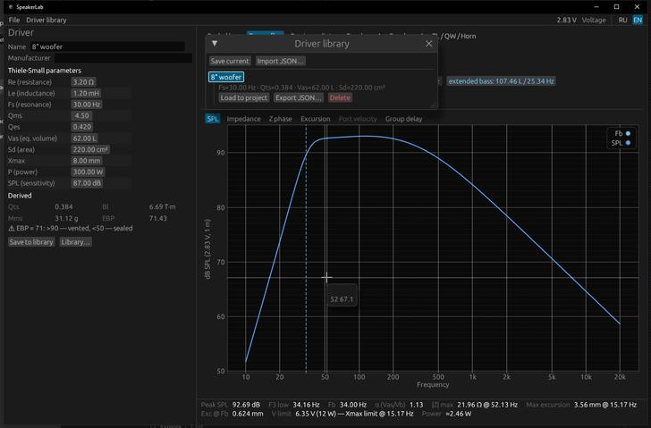

# SpeakerLab

[](https://github.com/EgorLikhachev/SpeakerLab/actions/workflows/ci.yml)
[](LICENSE)
[](CHANGELOG.md)
[](https://www.rust-lang.org)

SpeakerLab is a cross-platform desktop application for designing loudspeaker
enclosures. Enter the Thiele-Small parameters of a driver, pick an enclosure
type, and every graph (frequency response, impedance, cone excursion, port
air velocity, group delay) recalculates **live** while you drag any value —
no "Calculate" button. It covers the workflow of tools like BassBox Pro and
JBL SpeakerShop, with an engineering core in the spirit of Hornresp.

The user interface is available in **English and Russian** (switchable at
runtime). Runs on Windows, Linux, and macOS as a single native binary.

## Table of Contents

- [Screenshots](#screenshots)
- [Features](#features)
- [Prerequisites](#prerequisites)
- [Installation](#installation)
- [Usage](#usage)
- [Data and Configuration](#data-and-configuration)
- [Testing and Verification](#testing-and-verification)
- [Project Structure](#project-structure)
- [Contributing](#contributing)
- [License](#license)
- [Acknowledgements](#acknowledgements)

## Features

- **Enclosure types**: sealed box, bass-reflex (vented), passive radiator,
  4th- and 6th-order bandpass, transmission line / quarter-wave resonator /
  horn (segmented transmission-line model with stuffing).
- **Live recalculation**: change any parameter and all curves update in the
  same frame (fractions of a millisecond for 512 frequency points).
- **Graphs** (log frequency axis, mouse-wheel zoom): SPL, impedance
  magnitude, impedance phase, cone excursion with Xmax limit line, port air
  velocity with "chuffing" limits, group delay.
- **Port calculator**: length ⇄ tuning frequency, round or slot ports,
  multiple ports, end corrections (0.61 / 0.73 / 0.85), air-velocity check.
- **Box dimension calculator**: net vs gross volume, driver and port
  displacement, dimension presets (golden ratio etc.), external size and
  panel area.
- **Alignment suggestions** from T/S parameters: Qtc targets for sealed
  boxes, flat/compact/EBS tunings for vented boxes, passive radiator mass.
- **Reference comparison**: remember the current curves and overlay them as
  a dashed line on every graph.
- **Projects** (`.spkproj`) and a personal **driver library** in open JSON.
- **CSV export** of all calculated curves.
- **RU / EN interface** with live switching.

## Screenshots

Main window — live bass-reflex design with alignment suggestions and the
summary bar (F3, excursion, V-limit before Xmax, port velocity):



Port calculator (length ⇄ tuning, velocity check) and box dimension
calculator:

| Port calculator | Box dimensions |
|:---:|:---:|
|  |  |

Transmission line / quarter-wave / horn editor with per-segment geometry
and stuffing:



Personal driver library (open JSON, easy to share):



## Prerequisites

- [Rust](https://www.rust-lang.org/tools/install) **1.85 or newer** (stable toolchain).
- For curve verification only: Python 3.10+ with `numpy`.

Linux additionally needs GUI development packages (Ubuntu/Debian):

```bash
sudo apt install libgtk-3-dev libxcb-render0-dev libxcb-shape0-dev libxkbcommon-dev
```

## Installation

```bash
# 1. Clone the repository
git clone https://github.com/EgorLikhachev/SpeakerLab.git
cd SpeakerLab

# 2. Build and run (debug build)
cargo run -p speakerlab

# Or make an optimized release build
cargo build --release -p speakerlab
# The binary is at target/release/speakerlab (.exe on Windows)
```

## Usage

1. Launch the app (`cargo run -p speakerlab`). A realistic example 8"
   woofer is preloaded, so graphs are meaningful from the first second.
2. On the left, enter the T/S parameters of your driver
   (Fs, Qms, Qes, Vas, Sd, Re, Le, Xmax…). Derived values (Qts, Bl, Mms)
   update automatically; warnings flag suspicious input.
3. In the center, choose the enclosure type and adjust its parameters —
   watch the graphs respond in real time. Click a suggestion chip to apply
   a classic alignment in one click.
4. For a vented box, open the port calculator, define the port geometry,
   and apply it to the project to see port air velocity.
5. Save your work: **File → Save** creates a `.spkproj` project;
   **Save to library** stores the driver in your personal JSON library.

Example: verify the physics engine end to end (see the next section):

```bash
cargo run -p speakerlab-acoustics --example dump_curves > verify/curves.json
python verify/verify.py
```

## Data and Configuration

SpeakerLab does not use environment variables or configuration files that
you need to manage. It stores user data in the standard OS data directory:

| Data | Location |
|---|---|
| Driver library | `<OS data dir>/SpeakerLab/drivers/*.json` |
| UI settings (language) | `<OS data dir>/SpeakerLab/settings.json` |
| Projects | Wherever you save them (`.spkproj`, JSON format) |

All file formats are open JSON and safe to share or edit by hand.

## Testing and Verification

```bash
cargo test                       # 32 unit tests of the physics core
cargo fmt --all -- --check       # formatting check
cargo clippy --all-targets -- -D warnings   # lint check

# Independent cross-verification (Python + numpy):
cargo run -p speakerlab-acoustics --example dump_curves > verify/curves.json
python verify/verify.py          # 14 independent checks
```

The Python verifier re-implements the electro-mechano-acoustic circuit from
scratch and additionally checks against closed-form textbook formulas:
reference efficiency η₀ = 9.64·10⁻¹⁰·Fs³·Vas/Qes, sealed-box transfer
function, fc/Qtc/F3, the classic port length formula, and qualitative
signatures (impedance minimum and excursion dip at Fb, 24 dB/octave
rolloff, quarter-wave resonance). Summary of what is verified:

| What is checked | Method | Result |
|---|---|---|
| SPL, \|Z\|, excursion (sealed & vented, 512 points) | Independent Python circuit | match to 10⁻¹⁴ |
| Sealed-box response | Textbook H(s) = s²/(s²+ωc/Q·s+ωc²) | max Δ = 0.000 dB |
| fc, Qtc, F3 | Closed-form formulas | < 0.2 % |
| Absolute SPL level | η₀ reference efficiency (Thiele–Small) | 92.06 vs 91.85 dB |
| Port length | Classic 23562.5·D²/(Fb²·Vb) − k·D | < 0.05 cm |
| Vented-box physics | Z minimum & excursion dip at Fb, rolloff slope, double impedance peak | all present |

## Project Structure

```
SpeakerLab/
├── crates/
│   ├── acoustics/        # Physics core, no UI dependencies
│   │   └── src/
│   │       ├── driver.rs     # T/S parameters, derived values, validation
│   │       ├── circuit.rs    # Universal electro-mechano-acoustic solver
│   │       ├── sealed.rs     # Sealed box (2nd order)
│   │       ├── vented.rs     # Bass-reflex (4th order, Small's model)
│   │       ├── passive.rs    # Passive radiator
│   │       ├── bandpass.rs   # Bandpass 4th/6th order
│   │       ├── line.rs       # TL/QW/horn: segmented lossy-line (ABCD) model
│   │       ├── response.rs   # Frequency responses and summary metrics
│   │       ├── port.rs       # Port sizing calculator
│   │       ├── boxdim.rs     # Box dimension calculator
│   │       └── suggest.rs    # Alignment suggestions
│   └── app/              # egui GUI application
│       └── src/
│           ├── ui/           # Panels, plots, calculator windows
│           ├── locales/      # ru.yml, en.yml translations
│           ├── project.rs    # .spkproj save/load, CSV export
│           └── library.rs    # Personal driver library
├── verify/               # Independent Python verification
│   └── verify.py
└── .github/              # CI workflows and issue/PR templates
```

## Contributing

Contributions are welcome! Read [CONTRIBUTING.md](CONTRIBUTING.md) for the
development setup, branch/commit conventions, and the pull-request process.
Please also review our [Code of Conduct](CODE_OF_CONDUCT.md).

## License

This project is licensed under the [MIT License](LICENSE).

## Acknowledgements

- The lumped-element models follow the classic papers of A. N. Thiele and
  R. H. Small.
- The transmission-line model draws on the published work of L. J. S.
  Bradbury and G. L. Augspurger on fiber-filled lines.
- Inspired by the workflow of BassBox Pro, JBL SpeakerShop, WinISD, and
  Hornresp.
